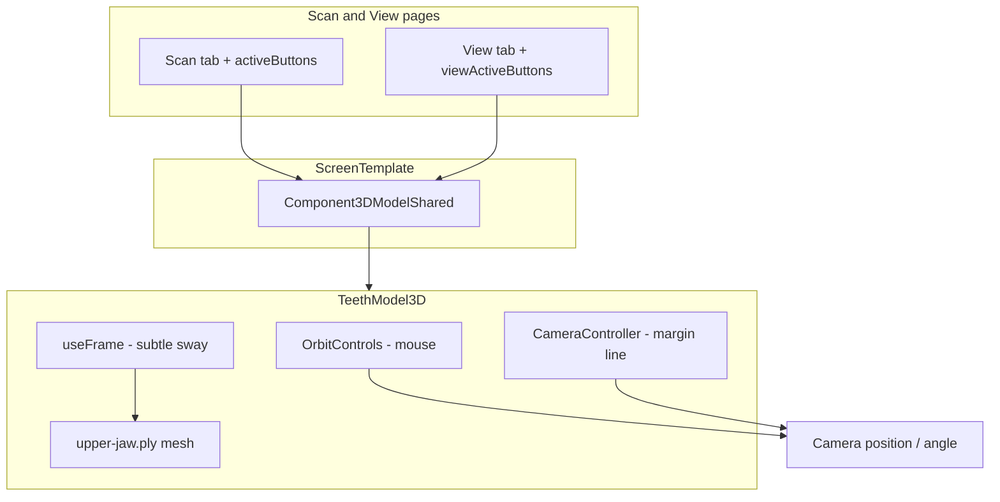

# 3D Model Movement — Scan & View Pages

This guide explains how the **interactive jaw model** works on the **Scan** and **View** pages (vertical, horizontal, top, and bottom toolbar layouts). That is the model you drag to orbit, zoom, and pan — and the one that reacts to toolbar buttons (monochrome, feedback, margin line, heatmap, etc.).

> **Scope:** Scan/View use `TeethModel3D` inside `ScreenTemplate` / `HorizontalScreenTemplate`. Other prototypes (Undercut page, Scan Guidance page) use different viewers — see [Appendix: other 3D pages](#appendix-other-3d-pages-not-scanview) at the end.

---

## 1. Where the model lives in the app

```
App.tsx
  └── ScreenTemplate (or HorizontalScreenTemplate)
        └── Component3DModelShared   ← one model for both Scan and View
              └── TeethModel3D      ← all movement + rendering
                    └── upper-jaw.ply
```

**Why one shared component?**  
`ScreenTemplate` keeps a **single** `TeethModel3D` mounted when you switch between Scan and View so the **camera angle and zoom stay the same** — only toolbar-driven props change.

```tsx
// ScreenTemplate.tsx — simplified
{currentPage !== 'info' && (
  <Component3DModelShared
    activeButtons={currentPage === 'scan' ? activeButtons : viewActiveButtons}
    isViewPage={currentPage === 'view'}
    opacity={modelOpacity}
    visible={modelVisible}
  />
)}
```

| File | Role |
|------|------|
| `src/components/TeethModel3D.tsx` | Canvas, lights, orbit controls, camera zoom, PLY loader |
| `src/imports/ScreenTemplate.tsx` | Vertical layout; wires toolbar → props |
| `src/components/HorizontalScreenTemplate.tsx` | Horizontal layouts; same `TeethModel3D` pattern |
| `src/assets/3d-models/upper-jaw.ply` | The model file shown on Scan/View |
| `src/App.tsx` | Holds `activeButtons` / `viewActiveButtons` state across layout switches |

---

## 2. What moves when you use Scan/View

On Scan and View there are **three** kinds of motion:

| Kind | What moves | How you trigger it |
|------|------------|-------------------|
| **Orbit / zoom / pan** | Camera | Mouse or trackpad on the model |
| **Margin line zoom** | Camera position (animated) | View toolbar — Margin Line button (index `3`) |
| **Idle sway** | Model mesh (tiny rotation) | Automatic — always on while the scene runs |

There is **no** mouse-follow rotation on Scan/View (that exists only on the separate Scan Guidance demo page).

```
┌──────────────────────────────────────────────┐
│  TeethModel3D (fills center of screen)        │
│                                               │
│   Camera  ◄──── OrbitControls (your mouse)   │
│   Camera  ◄──── CameraController (margin line) │
│                                               │
│   Group + Mesh  ◄── fixed tilt + subtle sway   │
│     upper-jaw.ply                             │
└──────────────────────────────────────────────┘
```

---

## 3. Mouse movement: `OrbitControls`

This is what makes the model feel good day to day. **drei’s `OrbitControls`** reads pointer input and updates the **camera** each frame.

From `TeethModel3D.tsx`:

```tsx
<OrbitControls
  enablePan={true}
  enableZoom={true}
  enableRotate={true}
  rotateSpeed={1.5}
  zoomSpeed={1.2}
  panSpeed={1.2}
  enableDamping={true}       // inertia after release
  dampingFactor={0.08}       // lower = more glide; higher = snappier stop
  minDistance={0.5}
  maxDistance={10}
  minPolarAngle={0.1}        // can't flip completely under the arch
  maxPolarAngle={Math.PI - 0.1}
  target={[0, 0, 0]}         // orbit pivot = centered arch
  makeDefault
/>
```

| Input | Effect |
|-------|--------|
| **Left drag** | Rotate (orbit around the arch) |
| **Right drag** | Pan |
| **Scroll / pinch** | Zoom in/out |

**`enableDamping`** is the main “quality” knob: the camera eases to a stop instead of snapping instantly.

**`touchAction: 'none'`** on the canvas stops the page from scrolling while you drag the model.

`showControls={true}` is always passed from Scan/View — controls are never hidden there.

---

## 4. Toolbar → model behavior (Scan vs View)

`Component3DModelShared` maps toolbar button indices to `TeethModel3D` props:

```tsx
// ScreenTemplate.tsx
const isMonochrome = activeButtons.has(0);
const isFeedback = !isViewPage && activeButtons.has(1);           // Scan only
const isMarginLineActive = isViewPage && activeButtons.has(3);   // View only
const isHeatmap = isViewPage && (activeButtons.has(2) || activeButtons.has(4)); // View only

<TeethModel3D
  modelUrl={upperJawModel}
  monochrome={isMonochrome}
  feedback={isFeedback}
  zoomIn={isMarginLineActive}
  heatmap={isHeatmap}
  opacity={opacity}
  ...
/>
```

| Button index | Scan page | View page | Prop / effect |
|--------------|-----------|-----------|----------------|
| `0` | Monochrome | Monochrome | `monochrome` — gray material |
| `1` | Feedback (blue marks) | — | `feedback` — vertex tint for “missing scan” |
| `2` | (panel UI) | Occlusalgram | `heatmap` when active on View |
| `3` | Undercut nav* | Margin line | `zoomIn` on View — camera moves closer |
| `4` | — | Prep QC | `heatmap` on View |

\* On Scan, button `3` navigates to the Undercut **page** (different viewer), not a zoom on this model.

State is owned in `App.tsx` and passed into `ScreenTemplate`:

- **Scan** → `activeButtons` / `onButtonClick`
- **View** → `viewActiveButtons` / `onViewButtonClick`

So each page has its **own** toolbar memory; switching Scan ↔ View does not reset the other page’s button set.

---

## 5. Margin line zoom (`CameraController`)

On **View**, turning on **Margin Line** smoothly moves the camera closer — without disabling orbit controls afterward.

**Default camera:** `[0, -2, 4.5]`  
**Zoomed in:** `[0, -1.2, 2.5]`  
**Duration:** 300ms with ease-out cubic

```tsx
// TeethModel3D.tsx — triggered when zoomIn prop changes
function CameraController({ zoomIn }: { zoomIn: boolean }) {
  const { camera } = useThree();
  // useEffect + requestAnimationFrame lerps camera.position
}

// Inside Canvas:
<CameraController zoomIn={zoomIn} />
```

**Important:** OrbitControls still owns rotation after the zoom animation. Users can orbit the zoomed-in view normally.

To change how close margin line feels, edit `zoomedPosition` / `defaultPosition` in `CameraController`.

---

## 6. Subtle model sway (`useFrame`)

The arch has a very small automatic rotation so it doesn’t look frozen:

```tsx
// PLYModel in TeethModel3D.tsx
useFrame((state) => {
  if (meshRef.current) {
    meshRef.current.rotation.y = Math.sin(state.clock.elapsedTime * 0.2) * 0.05;
  }
});
```

- Runs every frame (~60fps) via React Three Fiber  
- Only affects the **mesh**, not the camera  
- Amplitude `0.05` is intentionally tiny  

To disable sway on Scan/View, remove or gate this `useFrame` block in `PLYModel`.

---

## 7. How the model is positioned (not animated, but essential)

The PLY scan is centered and tilted so the occlusal view faces the camera:

```tsx
<Center>
  <group rotation={[Math.PI * 0.6, 0, Math.PI]}>
    <mesh geometry={centeredGeometry} scale={0.035} material={material} />
  </group>
</Center>
```

| Step | Purpose |
|------|---------|
| `geometry.center()` | Moves vertices so the arch sits on the orbit target `[0,0,0]` |
| `scale={0.035}` | PLY units are large; scale fits the default camera |
| `rotation={[π×0.6, 0, π]}` | Tilts upper jaw into the familiar chair-side angle |
| `Center` (drei) | Ensures the group is visually centered in the scene |

Default camera in `TeethModel3D`:

```tsx
camera={{ position: [0, -2, 4.5], fov: 40, near: 0.01, far: 1000, up: [0, 1, 0] }}
```

---

## 8. Visual modes (not movement, but tied to toolbar)

These change **appearance** via vertex colors / materials in `PLYModel` — the camera and controls stay the same:

| Prop | Scan/View trigger | What it does |
|------|-------------------|--------------|
| `monochrome` | Button `0` | Gray `MeshStandardMaterial` |
| `feedback` | Scan button `1` | Blue patches on vertices (“missing scan”) |
| `heatmap` | View buttons `2` or `4` | Occlusal pressure colormap on teeth |
| `opacity` | `modelOpacity` from parent | 0–100% transparency |

---

## 9. Tech stack (short)

| Layer | Library |
|-------|---------|
| Engine | Three.js |
| React | `@react-three/fiber` (`Canvas`, `useFrame`, `useThree`) |
| Helpers | `@react-three/drei` (`OrbitControls`, `Center`, `Environment`) |
| Loader | `PLYLoader` from `three-stdlib` |

Model import in layouts:

```tsx
import upperJawModel from '@/assets/3d-models/upper-jaw.ply?url';
```

---

## 10. How to change Scan/View movement

### Make orbit faster or slower

In `TeethModel3D.tsx` → `OrbitControls`:

- `rotateSpeed`, `zoomSpeed`, `panSpeed`
- `dampingFactor` (feel of inertia)

### Change default framing

- `camera.position` on `<Canvas>`
- `zoomedPosition` / `defaultPosition` in `CameraController`
- `scale` or `group rotation` on the PLY mesh

### Add a new toolbar-driven camera move

1. Add a prop on `TeethModel3D` (e.g. `focusMode`).  
2. Extend `CameraController` (or add a second effect) to lerp `camera.position` when that prop is true.  
3. Wire it in `Component3DModelShared` from `activeButtons.has(n)` or `viewActiveButtons.has(n)`.

### Swap the model file

Drop a new `.ply` / `.stl` / `.glb` in `src/assets/3d-models/` and change the import URL in `ScreenTemplate.tsx` (and horizontal template if needed). You may need to retune `scale` and `rotation` for a good first frame.

### Turn off auto-sway

Comment out the `useFrame` rotation in `PLYModel` inside `TeethModel3D.tsx`.

---

## 11. Props reference (`TeethModel3D`)

| Prop | Scan/View usage |
|------|-----------------|
| `modelUrl` | `upper-jaw.ply` |
| `showControls` | Always `true` on Scan/View |
| `autoRotate` | `false` (no idle spin) |
| `zoomIn` | View — margin line |
| `monochrome` | Both — button `0` |
| `feedback` | Scan only — button `1` |
| `heatmap` | View — buttons `2` or `4` |
| `opacity` | From `modelOpacity` when parent fades model |

---

## 12. Scan/View flow diagram



---

## Appendix: other 3D pages (not Scan/View)

| Page | File | Movement style |
|------|------|----------------|
| Undercut | `undercut/UndercutViewer.tsx` | Orbit + **draggable insertion arrows** |
| Scan Guidance | `scan-guidance/ScanGuidanceViewer.tsx` | Orbit + **mouse-follow rotation** + scan coverage |

Those are separate `Canvas` instances with different logic. Copy patterns from them only if you intentionally add similar behavior to Scan/View.

---

## Further reading

- [React Three Fiber — useFrame](https://docs.pmnd.rs/react-three-fiber/tutorials/basic-animations#useframe)
- [drei — OrbitControls](https://github.com/pmndrs/drei#controls)
